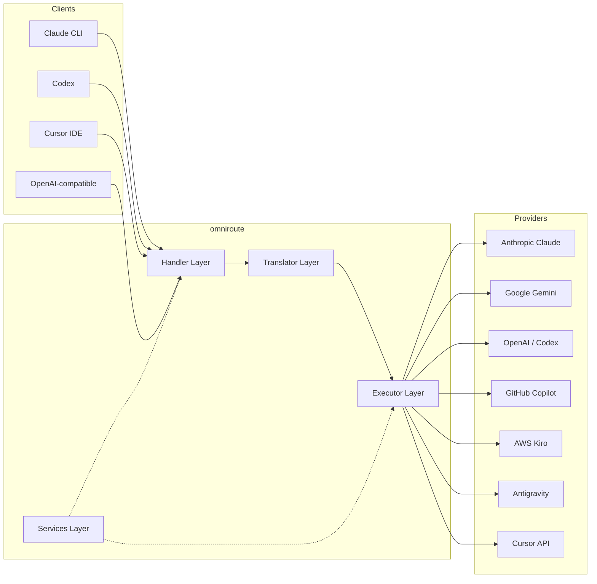
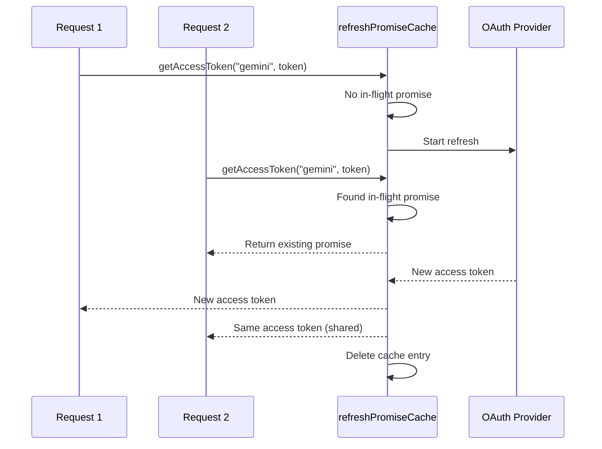
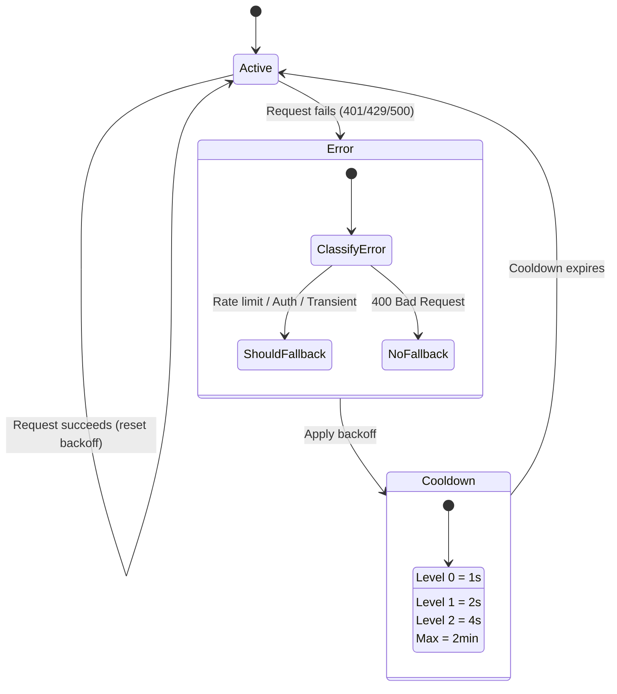
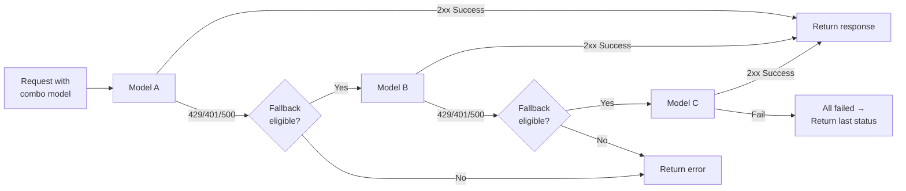
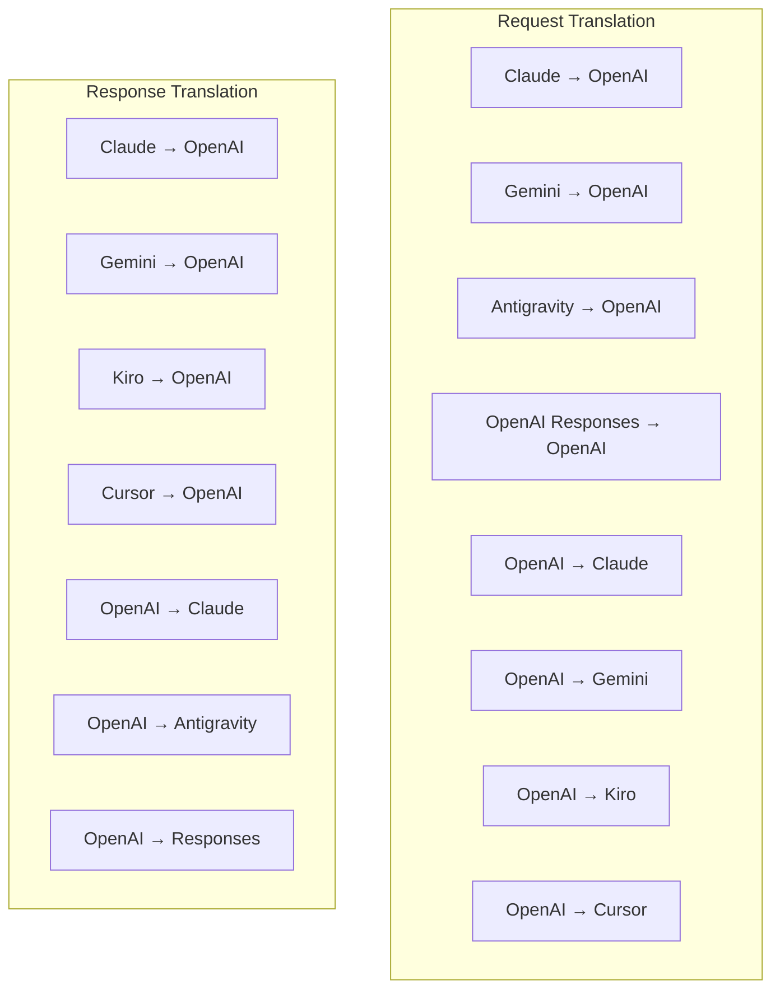
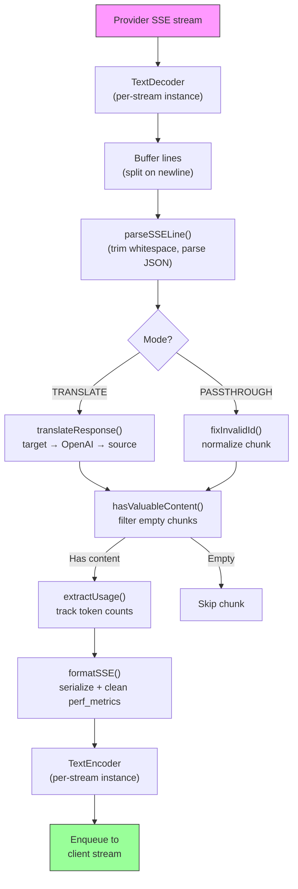
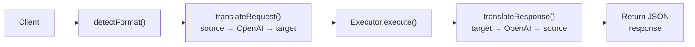
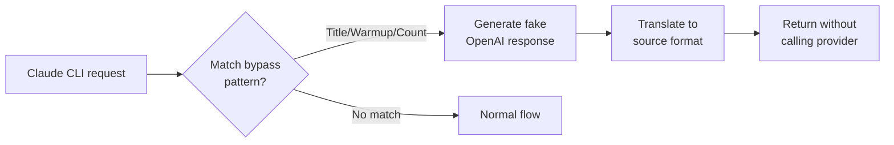

# omniroute — Codebase Documentation (Türkçe)

<<<<<<< HEAD
🌐 **Languages:** 🇺🇸 [English](../../../../docs/CODEBASE_DOCUMENTATION.md) · 🇸🇦 [ar](../../ar/docs/CODEBASE_DOCUMENTATION.md) · 🇧🇬 [bg](../../bg/docs/CODEBASE_DOCUMENTATION.md) · 🇧🇩 [bn](../../bn/docs/CODEBASE_DOCUMENTATION.md) · 🇨🇿 [cs](../../cs/docs/CODEBASE_DOCUMENTATION.md) · 🇩🇰 [da](../../da/docs/CODEBASE_DOCUMENTATION.md) · 🇩🇪 [de](../../de/docs/CODEBASE_DOCUMENTATION.md) · 🇪🇸 [es](../../es/docs/CODEBASE_DOCUMENTATION.md) · 🇮🇷 [fa](../../fa/docs/CODEBASE_DOCUMENTATION.md) · 🇫🇮 [fi](../../fi/docs/CODEBASE_DOCUMENTATION.md) · 🇫🇷 [fr](../../fr/docs/CODEBASE_DOCUMENTATION.md) · 🇮🇳 [gu](../../gu/docs/CODEBASE_DOCUMENTATION.md) · 🇮🇱 [he](../../he/docs/CODEBASE_DOCUMENTATION.md) · 🇮🇳 [hi](../../hi/docs/CODEBASE_DOCUMENTATION.md) · 🇭🇺 [hu](../../hu/docs/CODEBASE_DOCUMENTATION.md) · 🇮🇩 [id](../../id/docs/CODEBASE_DOCUMENTATION.md) · 🇮🇹 [it](../../it/docs/CODEBASE_DOCUMENTATION.md) · 🇯🇵 [ja](../../ja/docs/CODEBASE_DOCUMENTATION.md) · 🇰🇷 [ko](../../ko/docs/CODEBASE_DOCUMENTATION.md) · 🇮🇳 [mr](../../mr/docs/CODEBASE_DOCUMENTATION.md) · 🇲🇾 [ms](../../ms/docs/CODEBASE_DOCUMENTATION.md) · 🇳🇱 [nl](../../nl/docs/CODEBASE_DOCUMENTATION.md) · 🇳🇴 [no](../../no/docs/CODEBASE_DOCUMENTATION.md) · 🇵🇭 [phi](../../phi/docs/CODEBASE_DOCUMENTATION.md) · 🇵🇱 [pl](../../pl/docs/CODEBASE_DOCUMENTATION.md) · 🇵🇹 [pt](../../pt/docs/CODEBASE_DOCUMENTATION.md) · 🇧🇷 [pt-BR](../../pt-BR/docs/CODEBASE_DOCUMENTATION.md) · 🇷🇴 [ro](../../ro/docs/CODEBASE_DOCUMENTATION.md) · 🇷🇺 [ru](../../ru/docs/CODEBASE_DOCUMENTATION.md) · 🇸🇰 [sk](../../sk/docs/CODEBASE_DOCUMENTATION.md) · 🇸🇪 [sv](../../sv/docs/CODEBASE_DOCUMENTATION.md) · 🇰🇪 [sw](../../sw/docs/CODEBASE_DOCUMENTATION.md) · 🇮🇳 [ta](../../ta/docs/CODEBASE_DOCUMENTATION.md) · 🇮🇳 [te](../../te/docs/CODEBASE_DOCUMENTATION.md) · 🇹🇭 [th](../../th/docs/CODEBASE_DOCUMENTATION.md) · 🇹🇷 [tr](../../tr/docs/CODEBASE_DOCUMENTATION.md) · 🇺🇦 [uk-UA](../../uk-UA/docs/CODEBASE_DOCUMENTATION.md) · 🇵🇰 [ur](../../ur/docs/CODEBASE_DOCUMENTATION.md) · 🇻🇳 [vi](../../vi/docs/CODEBASE_DOCUMENTATION.md) · 🇨🇳 [zh-CN](../../zh-CN/docs/CODEBASE_DOCUMENTATION.md)

---

> A comprehensive, beginner-friendly guide to the **omniroute** multi-provider AI proxy router.

---

## 1. What Is omniroute?

omniroute is a **proxy router** that sits between AI clients (Claude CLI, Codex, Cursor IDE, etc.) and AI providers (Anthropic, Google, OpenAI, AWS, GitHub, etc.). It solves one big problem:

> **Different AI clients speak different "languages" (API formats), and different AI providers expect different "languages" too.** omniroute translates between them automatically.

Think of it like a universal translator at the United Nations — any delegate can speak any language, and the translator converts it for any other delegate.

---
=======
🌐 **Languages:** 🇺🇸 [English](../../../../docs/CODEBASE_DOCUMENTATION.md) · 🇪🇸 [es](../../es/docs/CODEBASE_DOCUMENTATION.md) · 🇫🇷 [fr](../../fr/docs/CODEBASE_DOCUMENTATION.md) · 🇩🇪 [de](../../de/docs/CODEBASE_DOCUMENTATION.md) · 🇮🇹 [it](../../it/docs/CODEBASE_DOCUMENTATION.md) · 🇷🇺 [ru](../../ru/docs/CODEBASE_DOCUMENTATION.md) · 🇨🇳 [zh-CN](../../zh-CN/docs/CODEBASE_DOCUMENTATION.md) · 🇯🇵 [ja](../../ja/docs/CODEBASE_DOCUMENTATION.md) · 🇰🇷 [ko](../../ko/docs/CODEBASE_DOCUMENTATION.md) · 🇸🇦 [ar](../../ar/docs/CODEBASE_DOCUMENTATION.md) · 🇮🇳 [hi](../../hi/docs/CODEBASE_DOCUMENTATION.md) · 🇮🇳 [in](../../in/docs/CODEBASE_DOCUMENTATION.md) · 🇹🇭 [th](../../th/docs/CODEBASE_DOCUMENTATION.md) · 🇻🇳 [vi](../../vi/docs/CODEBASE_DOCUMENTATION.md) · 🇮🇩 [id](../../id/docs/CODEBASE_DOCUMENTATION.md) · 🇲🇾 [ms](../../ms/docs/CODEBASE_DOCUMENTATION.md) · 🇳🇱 [nl](../../nl/docs/CODEBASE_DOCUMENTATION.md) · 🇵🇱 [pl](../../pl/docs/CODEBASE_DOCUMENTATION.md) · 🇸🇪 [sv](../../sv/docs/CODEBASE_DOCUMENTATION.md) · 🇳🇴 [no](../../no/docs/CODEBASE_DOCUMENTATION.md) · 🇩🇰 [da](../../da/docs/CODEBASE_DOCUMENTATION.md) · 🇫🇮 [fi](../../fi/docs/CODEBASE_DOCUMENTATION.md) · 🇵🇹 [pt](../../pt/docs/CODEBASE_DOCUMENTATION.md) · 🇷🇴 [ro](../../ro/docs/CODEBASE_DOCUMENTATION.md) · 🇭🇺 [hu](../../hu/docs/CODEBASE_DOCUMENTATION.md) · 🇧🇬 [bg](../../bg/docs/CODEBASE_DOCUMENTATION.md) · 🇸🇰 [sk](../../sk/docs/CODEBASE_DOCUMENTATION.md) · 🇺🇦 [uk-UA](../../uk-UA/docs/CODEBASE_DOCUMENTATION.md) · 🇮🇱 [he](../../he/docs/CODEBASE_DOCUMENTATION.md) · 🇵🇭 [phi](../../phi/docs/CODEBASE_DOCUMENTATION.md) · 🇧🇷 [pt-BR](../../pt-BR/docs/CODEBASE_DOCUMENTATION.md) · 🇨🇿 [cs](../../cs/docs/CODEBASE_DOCUMENTATION.md) · 🇹🇷 [tr](../../tr/docs/CODEBASE_DOCUMENTATION.md)

---

> **omniroute**çok sağlayıcılı AI proxy yönlendiricisine yönelik kapsamlı, başlangıç ​​seviyesi dostu bir kılavuz.---

## 1. What Is omniroute?

omniroute, AI istemcileri (Claude CLI, Codex, Cursor IDE vb.) ile AI sağlayıcıları (Anthropic, Google, OpenAI, AWS, GitHub vb.) arasında bulunan bir**proxy yönlendiricisidir**. Büyük bir sorunu çözüyor:

> **Farklı AI istemcileri farklı "diller" (API formatları) konuşur ve farklı AI sağlayıcıları da farklı "diller" bekler.**omniroute bunlar arasında otomatik olarak çeviri yapar.

Bunu Birleşmiş Milletler'deki evrensel bir tercüman gibi düşünün; her delege herhangi bir dili konuşabilir ve tercüman bunu diğer delegeler için çevirir.---
>>>>>>> origin/feat/go-port-and-ui-improvements-13710034216498711139

## 2. Architecture Overview



### Core Principle: Hub-and-Spoke Translation

<<<<<<< HEAD
All format translation passes through **OpenAI format as the hub**:

```
Client Format → [OpenAI Hub] → Provider Format    (request)
Provider Format → [OpenAI Hub] → Client Format    (response)
```

This means you only need **N translators** (one per format) instead of **N²** (every pair).

---
=======
Tüm format çevirileri**hub olarak OpenAI formatından**geçer:```
Client Format → [OpenAI Hub] → Provider Format (request)
Provider Format → [OpenAI Hub] → Client Format (response)

```

Bu,**N²**(her çift) yerine yalnızca**N çevirmene**(format başına bir tane) ihtiyacınız olduğu anlamına gelir.---
>>>>>>> origin/feat/go-port-and-ui-improvements-13710034216498711139

## 3. Project Structure

```
<<<<<<< HEAD
omniroute/
├── open-sse/                  ← Core proxy library (portable, framework-agnostic)
│   ├── index.js               ← Main entry point, exports everything
│   ├── config/                ← Configuration & constants
│   ├── executors/             ← Provider-specific request execution
│   ├── handlers/              ← Request handling orchestration
│   ├── services/              ← Business logic (auth, models, fallback, usage)
│   ├── translator/            ← Format translation engine
│   │   ├── request/           ← Request translators (8 files)
│   │   ├── response/          ← Response translators (7 files)
│   │   └── helpers/           ← Shared translation utilities (6 files)
│   └── utils/                 ← Utility functions
├── src/                       ← Application layer (Express/Worker runtime)
│   ├── app/                   ← Web UI, API routes, middleware
│   ├── lib/                   ← Database, auth, and shared library code
│   ├── mitm/                  ← Man-in-the-middle proxy utilities
│   ├── models/                ← Database models
│   ├── shared/                ← Shared utilities (wrappers around open-sse)
│   ├── sse/                   ← SSE endpoint handlers
│   └── store/                 ← State management
├── data/                      ← Runtime data (credentials, logs)
│   └── provider-credentials.json   (external credentials override, gitignored)
└── tester/                    ← Test utilities
```
=======

omniroute/
├── open-sse/ ← Core proxy library (portable, framework-agnostic)
│ ├── index.js ← Main entry point, exports everything
│ ├── config/ ← Configuration & constants
│ ├── executors/ ← Provider-specific request execution
│ ├── handlers/ ← Request handling orchestration
│ ├── services/ ← Business logic (auth, models, fallback, usage)
│ ├── translator/ ← Format translation engine
│ │ ├── request/ ← Request translators (8 files)
│ │ ├── response/ ← Response translators (7 files)
│ │ └── helpers/ ← Shared translation utilities (6 files)
│ └── utils/ ← Utility functions
├── src/ ← Application layer (Express/Worker runtime)
│ ├── app/ ← Web UI, API routes, middleware
│ ├── lib/ ← Database, auth, and shared library code
│ ├── mitm/ ← Man-in-the-middle proxy utilities
│ ├── models/ ← Database models
│ ├── shared/ ← Shared utilities (wrappers around open-sse)
│ ├── sse/ ← SSE endpoint handlers
│ └── store/ ← State management
├── data/ ← Runtime data (credentials, logs)
│ └── provider-credentials.json (external credentials override, gitignored)
└── tester/ ← Test utilities

````
>>>>>>> origin/feat/go-port-and-ui-improvements-13710034216498711139

---

## 4. Module-by-Module Breakdown

### 4.1 Config (`open-sse/config/`)

<<<<<<< HEAD
The **single source of truth** for all provider configuration.

| File                          | Purpose                                                                                                                                                                                                                   |
| ----------------------------- | ------------------------------------------------------------------------------------------------------------------------------------------------------------------------------------------------------------------------- |
| `constants.ts`                | `PROVIDERS` object with base URLs, OAuth credentials (defaults), headers, and default system prompts for every provider. Also defines `HTTP_STATUS`, `ERROR_TYPES`, `COOLDOWN_MS`, `BACKOFF_CONFIG`, and `SKIP_PATTERNS`. |
| `credentialLoader.ts`         | Loads external credentials from `data/provider-credentials.json` and merges them over the hardcoded defaults in `PROVIDERS`. Keeps secrets out of source control while maintaining backwards compatibility.               |
| `providerModels.ts`           | Central model registry: maps provider aliases → model IDs. Functions like `getModels()`, `getProviderByAlias()`.                                                                                                          |
| `codexInstructions.ts`        | System instructions injected into Codex requests (editing constraints, sandbox rules, approval policies).                                                                                                                 |
| `defaultThinkingSignature.ts` | Default "thinking" signatures for Claude and Gemini models.                                                                                                                                                               |
| `ollamaModels.ts`             | Schema definition for local Ollama models (name, size, family, quantization).                                                                                                                                             |

#### Credential Loading Flow
=======
Tüm sağlayıcı yapılandırmaları için**tek gerçek kaynak**.

| Dosya | Amaç |
| ----------------------------- | ----------------------------------------------------------------------------------------------------------------------------------------------------------------------------------------------------------------------------------- |
| 'sabitler.ts' | Her sağlayıcı için temel URL'ler, OAuth kimlik bilgileri (varsayılanlar), başlıklar ve varsayılan sistem istemlerini içeren "PROVIDERS" nesnesi. Ayrıca "HTTP_STATUS", "ERROR_TYPES", "COOLDOWN_MS", "BACKOFF_CONFIG" ve "SKIP_PATTERNS" öğelerini de tanımlar. |
| `credentialLoader.ts' | "data/provider-credentials.json"dan harici kimlik bilgilerini yükler ve bunları "PROVIDERS" içindeki sabit kodlanmış varsayılanlar üzerinden birleştirir. Geriye dönük uyumluluğu korurken sırları kaynak kontrolünün dışında tutar.               |
| 'providerModels.ts' | Merkezi model kaydı: sağlayıcı takma adlarını eşler → model kimlikleri. `getModels()`, `getProviderByAlias()` gibi işlevler.                                                                                                          |
| `codexInstructions.ts` | Codex isteklerine eklenen sistem talimatları (kısıtlamaları düzenleme, sanal alan kuralları, onay politikaları).                                                                                                                 |
| 'defaultThinkingSignature.ts' | Claude ve Gemini modelleri için varsayılan "düşünme" imzaları.                                                                                                                                                               |
| `ollamaModels.ts` | Yerel Ollama modelleri için şema tanımı (isim, boyut, aile, nicemleme).                                                                                                                                             |#### Credential Loading Flow
>>>>>>> origin/feat/go-port-and-ui-improvements-13710034216498711139

```mermaid
flowchart TD
    A["App starts"] --> B["constants.ts defines PROVIDERS\nwith hardcoded defaults"]
    B --> C{"data/provider-credentials.json\nexists?"}
    C -->|Yes| D["credentialLoader reads JSON"]
    C -->|No| E["Use hardcoded defaults"]
    D --> F{"For each provider in JSON"}
    F --> G{"Provider exists\nin PROVIDERS?"}
    G -->|No| H["Log warning, skip"]
    G -->|Yes| I{"Value is object?"}
    I -->|No| J["Log warning, skip"]
    I -->|Yes| K["Merge clientId, clientSecret,\ntokenUrl, authUrl, refreshUrl"]
    K --> F
    H --> F
    J --> F
    F -->|Done| L["PROVIDERS ready with\nmerged credentials"]
    E --> L
<<<<<<< HEAD
```
=======
````
>>>>>>> origin/feat/go-port-and-ui-improvements-13710034216498711139

---

### 4.2 Executors (`open-sse/executors/`)

<<<<<<< HEAD
Executors encapsulate **provider-specific logic** using the **Strategy Pattern**. Each executor overrides base methods as needed.

```mermaid
classDiagram
    class BaseExecutor {
        +buildUrl(model, stream, options)
        +buildHeaders(credentials, stream, body)
        +transformRequest(body, model, stream, credentials)
        +execute(url, options)
        +shouldRetry(status, error)
        +refreshCredentials(credentials, log)
    }
=======
Yürütücüler**Strateji Modeli**kullanarak**sağlayıcıya özel mantığı**kapsüller. Her yürütücü gerektiğinde temel yöntemleri geçersiz kılar.```mermaid
classDiagram
class BaseExecutor {
+buildUrl(model, stream, options)
+buildHeaders(credentials, stream, body)
+transformRequest(body, model, stream, credentials)
+execute(url, options)
+shouldRetry(status, error)
+refreshCredentials(credentials, log)
}
>>>>>>> origin/feat/go-port-and-ui-improvements-13710034216498711139

    class DefaultExecutor {
        +refreshCredentials()
    }

    class AntigravityExecutor {
        +buildUrl()
        +buildHeaders()
        +transformRequest()
        +shouldRetry()
        +refreshCredentials()
    }

    class CursorExecutor {
        +buildUrl()
        +buildHeaders()
        +transformRequest()
        +parseResponse()
        +generateChecksum()
    }

    class KiroExecutor {
        +buildUrl()
        +buildHeaders()
        +transformRequest()
        +parseEventStream()
        +refreshCredentials()
    }

    BaseExecutor <|-- DefaultExecutor
    BaseExecutor <|-- AntigravityExecutor
    BaseExecutor <|-- CursorExecutor
    BaseExecutor <|-- KiroExecutor
    BaseExecutor <|-- CodexExecutor
    BaseExecutor <|-- GeminiCLIExecutor
    BaseExecutor <|-- GithubExecutor
<<<<<<< HEAD
```

| Executor         | Provider                                   | Key Specializations                                                                                                 |
| ---------------- | ------------------------------------------ | ------------------------------------------------------------------------------------------------------------------- |
| `base.ts`        | —                                          | Abstract base: URL building, headers, retry logic, credential refresh                                               |
| `default.ts`     | Claude, Gemini, OpenAI, GLM, Kimi, MiniMax | Generic OAuth token refresh for standard providers                                                                  |
| `antigravity.ts` | Google Cloud Code                          | Project/session ID generation, multi-URL fallback, custom retry parsing from error messages ("reset after 2h7m23s") |
| `cursor.ts`      | Cursor IDE                                 | **Most complex**: SHA-256 checksum auth, Protobuf request encoding, binary EventStream → SSE response parsing       |
| `codex.ts`       | OpenAI Codex                               | Injects system instructions, manages thinking levels, removes unsupported parameters                                |
| `gemini-cli.ts`  | Google Gemini CLI                          | Custom URL building (`streamGenerateContent`), Google OAuth token refresh                                           |
| `github.ts`      | GitHub Copilot                             | Dual token system (GitHub OAuth + Copilot token), VSCode header mimicking                                           |
| `kiro.ts`        | AWS CodeWhisperer                          | AWS EventStream binary parsing, AMZN event frames, token estimation                                                 |
| `index.ts`       | —                                          | Factory: maps provider name → executor class, with default fallback                                                 |

---

### 4.3 Handlers (`open-sse/handlers/`)

The **orchestration layer** — coordinates translation, execution, streaming, and error handling.

| File                  | Purpose                                                                                                                                                                                                                |
| --------------------- | ---------------------------------------------------------------------------------------------------------------------------------------------------------------------------------------------------------------------- |
| `chatCore.ts`         | **Central orchestrator** (~600 lines). Handles the complete request lifecycle: format detection → translation → executor dispatch → streaming/non-streaming response → token refresh → error handling → usage logging. |
| `responsesHandler.ts` | Adapter for OpenAI's Responses API: converts Responses format → Chat Completions → sends to `chatCore` → converts SSE back to Responses format.                                                                        |
| `embeddings.ts`       | Embedding generation handler: resolves embedding model → provider, dispatches to provider API, returns OpenAI-compatible embedding response. Supports 6+ providers.                                                    |
| `imageGeneration.ts`  | Image generation handler: resolves image model → provider, supports OpenAI-compatible, Gemini-image (Antigravity), and fallback (Nebius) modes. Returns base64 or URL images.                                          |

#### Request Lifecycle (chatCore.ts)
=======

````

| Yürütücü | Sağlayıcı | Anahtar Uzmanlıklar |
| ---------------- | ------------------------------- | ------------------------------------------------------------------------------------------------------------------- |
| 'base.ts' | — | Özet tabanı: URL oluşturma, başlıklar, yeniden deneme mantığı, kimlik bilgileri yenileme |
| 'varsayılan.ts' | Claude, İkizler, OpenAI, GLM, Kimi, MiniMax | Standart sağlayıcılar için genel OAuth belirteci yenilemesi |
| 'antigravity.ts' | Google Bulut Kodu | Proje/oturum kimliği oluşturma, çoklu URL geri dönüşü, hata mesajlarından özel yeniden ayrıştırma denemesi ("2 saat 7 dakika 23 saniye sonra sıfırlama") |
| imleç.ts | İmleç IDE'si |**En karmaşık**: SHA-256 sağlama toplamı kimlik doğrulaması, Protobuf istek kodlaması, ikili EventStream → SSE yanıt ayrıştırma |
| 'codex.ts' | OpenAI Kodeksi | Sistem talimatlarını enjekte eder, düşünme seviyelerini yönetir, desteklenmeyen parametreleri kaldırır |
| 'gemini-cli.ts' | Google İkizler CLI | Özel URL oluşturma (`streamGenerateContent`), Google OAuth belirteci yenileme |
| github.ts | GitHub Yardımcı Pilotu | Çift jeton sistemi (GitHub OAuth + Copilot jetonu), VSCode üstbilgisini taklit eden |
| kiro.ts | AWS CodeWhisperer | AWS EventStream ikili ayrıştırma, AMZN olay çerçeveleri, belirteç tahmini |
| 'index.ts' | — | Fabrika: harita sağlayıcı adı → yürütücü sınıfı, varsayılan geri dönüş ile |---

### 4.3 Handlers (`open-sse/handlers/`)

**Orkestrasyon katmanı**— çeviriyi, yürütmeyi, akışı ve hata işlemeyi koordine eder.

| Dosya | Amaç |
| --------------------- | ---------------------------------------------------------------------------------------------------------------------------------------------------------------------------------------------------------------------------------- |
| 'chatCore.ts' |**Merkezi orkestratör**(~600 satır). İstek yaşam döngüsünün tamamını yönetir: format algılama → çeviri → yürütücü gönderimi → akışlı/akışsız yanıt → belirteç yenileme → hata işleme → kullanım günlüğü. |
| `responsesHandler.ts` | OpenAI'nin Yanıt API'si için Bağdaştırıcı: Yanıt formatını dönüştürür → Sohbet Tamamlamalarını → `chatCore'a gönderir → SSE'yi tekrar Yanıt formatına dönüştürür.                                                                        |
| 'embeddings.ts' | Gömme oluşturma işleyicisi: yerleştirme modelini çözer → sağlayıcı, sağlayıcı API'sine gönderir, OpenAI uyumlu yerleştirme yanıtını döndürür. 6+ sağlayıcıyı destekler.                                                    |
| `imageGeneration.ts' | Görüntü oluşturma işleyicisi: görüntü modelini çözer → sağlayıcı, OpenAI uyumlu, Gemini görüntüsü (Antigravity) ve geri dönüş (Nebius) modlarını destekler. Base64 veya URL resimlerini döndürür.                                          |#### Request Lifecycle (chatCore.ts)
>>>>>>> origin/feat/go-port-and-ui-improvements-13710034216498711139

```mermaid
sequenceDiagram
    participant Client
    participant chatCore
    participant Translator
    participant Executor
    participant Provider

    Client->>chatCore: Request (any format)
    chatCore->>chatCore: Detect source format
    chatCore->>chatCore: Check bypass patterns
    chatCore->>chatCore: Resolve model & provider
    chatCore->>Translator: Translate request (source → OpenAI → target)
    chatCore->>Executor: Get executor for provider
    Executor->>Executor: Build URL, headers, transform request
    Executor->>Executor: Refresh credentials if needed
    Executor->>Provider: HTTP fetch (streaming or non-streaming)

    alt Streaming
        Provider-->>chatCore: SSE stream
        chatCore->>chatCore: Pipe through SSE transform stream
        Note over chatCore: Transform stream translates<br/>each chunk: target → OpenAI → source
        chatCore-->>Client: Translated SSE stream
    else Non-streaming
        Provider-->>chatCore: JSON response
        chatCore->>Translator: Translate response
        chatCore-->>Client: Translated JSON
    end

    alt Error (401, 429, 500...)
        chatCore->>Executor: Retry with credential refresh
        chatCore->>chatCore: Account fallback logic
    end
<<<<<<< HEAD
```
=======
````
>>>>>>> origin/feat/go-port-and-ui-improvements-13710034216498711139

---

### 4.4 Services (`open-sse/services/`)

<<<<<<< HEAD
Business logic that supports the handlers and executors.

| File                 | Purpose                                                                                                                                                                                                                                                                                                                                |
| -------------------- | -------------------------------------------------------------------------------------------------------------------------------------------------------------------------------------------------------------------------------------------------------------------------------------------------------------------------------------- |
| `provider.ts`        | **Format detection** (`detectFormat`): analyzes request body structure to identify Claude/OpenAI/Gemini/Antigravity/Responses formats (includes `max_tokens` heuristic for Claude). Also: URL building, header building, thinking config normalization. Supports `openai-compatible-*` and `anthropic-compatible-*` dynamic providers. |
| `model.ts`           | Model string parsing (`claude/model-name` → `{provider: "claude", model: "model-name"}`), alias resolution with collision detection, input sanitization (rejects path traversal/control chars), and model info resolution with async alias getter support.                                                                             |
| `accountFallback.ts` | Rate-limit handling: exponential backoff (1s → 2s → 4s → max 2min), account cooldown management, error classification (which errors trigger fallback vs. not).                                                                                                                                                                         |
| `tokenRefresh.ts`    | OAuth token refresh for **every provider**: Google (Gemini, Antigravity), Claude, Codex, Qwen, Qoder, GitHub (OAuth + Copilot dual-token), Kiro (AWS SSO OIDC + Social Auth). Includes in-flight promise deduplication cache and retry with exponential backoff.                                                                       |
| `combo.ts`           | **Combo models**: chains of fallback models. If model A fails with a fallback-eligible error, try model B, then C, etc. Returns actual upstream status codes.                                                                                                                                                                          |
| `usage.ts`           | Fetches quota/usage data from provider APIs (GitHub Copilot quotas, Antigravity model quotas, Codex rate limits, Kiro usage breakdowns, Claude settings).                                                                                                                                                                              |
| `accountSelector.ts` | Smart account selection with scoring algorithm: considers priority, health status, round-robin position, and cooldown state to pick the optimal account for each request.                                                                                                                                                              |
| `contextManager.ts`  | Request context lifecycle management: creates and tracks per-request context objects with metadata (request ID, timestamps, provider info) for debugging and logging.                                                                                                                                                                  |
| `ipFilter.ts`        | IP-based access control: supports allowlist and blocklist modes. Validates client IP against configured rules before processing API requests.                                                                                                                                                                                          |
| `sessionManager.ts`  | Session tracking with client fingerprinting: tracks active sessions using hashed client identifiers, monitors request counts, and provides session metrics.                                                                                                                                                                            |
| `signatureCache.ts`  | Request signature-based deduplication cache: prevents duplicate requests by caching recent request signatures and returning cached responses for identical requests within a time window.                                                                                                                                              |
| `systemPrompt.ts`    | Global system prompt injection: prepends or appends a configurable system prompt to all requests, with per-provider compatibility handling.                                                                                                                                                                                            |
| `thinkingBudget.ts`  | Reasoning token budget management: supports passthrough, auto (strip thinking config), custom (fixed budget), and adaptive (complexity-scaled) modes for controlling thinking/reasoning tokens.                                                                                                                                        |
| `wildcardRouter.ts`  | Wildcard model pattern routing: resolves wildcard patterns (e.g., `*/claude-*`) to concrete provider/model pairs based on availability and priority.                                                                                                                                                                                   |
=======
| İşleyicileri ve yürütücüleri destekleyen iş mantığı. | File                                                                                                                                                                                                                                                                                                                                   | Purpose |
| ---------------------------------------------------- | -------------------------------------------------------------------------------------------------------------------------------------------------------------------------------------------------------------------------------------------------------------------------------------------------------------------------------------- | ------- |
| `provider.ts`                                        | **Format detection** (`detectFormat`): analyzes request body structure to identify Claude/OpenAI/Gemini/Antigravity/Responses formats (includes `max_tokens` heuristic for Claude). Also: URL building, header building, thinking config normalization. Supports `openai-compatible-*` and `anthropic-compatible-*` dynamic providers. |
| `model.ts`                                           | Model string parsing (`claude/model-name` → `{provider: "claude", model: "model-name"}`), alias resolution with collision detection, input sanitization (rejects path traversal/control chars), and model info resolution with async alias getter support.                                                                             |
| `accountFallback.ts`                                 | Rate-limit handling: exponential backoff (1s → 2s → 4s → max 2min), account cooldown management, error classification (which errors trigger fallback vs. not).                                                                                                                                                                         |
| `tokenRefresh.ts`                                    | OAuth token refresh for **every provider**: Google (Gemini, Antigravity), Claude, Codex, Qwen, Qoder, GitHub (OAuth + Copilot dual-token), Kiro (AWS SSO OIDC + Social Auth). Includes in-flight promise deduplication cache and retry with exponential backoff.                                                                       |
| `combo.ts`                                           | **Combo models**: chains of fallback models. If model A fails with a fallback-eligible error, try model B, then C, etc. Returns actual upstream status codes.                                                                                                                                                                          |
| `usage.ts`                                           | Fetches quota/usage data from provider APIs (GitHub Copilot quotas, Antigravity model quotas, Codex rate limits, Kiro usage breakdowns, Claude settings).                                                                                                                                                                              |
| `accountSelector.ts`                                 | Smart account selection with scoring algorithm: considers priority, health status, round-robin position, and cooldown state to pick the optimal account for each request.                                                                                                                                                              |
| `contextManager.ts`                                  | Request context lifecycle management: creates and tracks per-request context objects with metadata (request ID, timestamps, provider info) for debugging and logging.                                                                                                                                                                  |
| `ipFilter.ts`                                        | IP-based access control: supports allowlist and blocklist modes. Validates client IP against configured rules before processing API requests.                                                                                                                                                                                          |
| `sessionManager.ts`                                  | Session tracking with client fingerprinting: tracks active sessions using hashed client identifiers, monitors request counts, and provides session metrics.                                                                                                                                                                            |
| `signatureCache.ts`                                  | Request signature-based deduplication cache: prevents duplicate requests by caching recent request signatures and returning cached responses for identical requests within a time window.                                                                                                                                              |
| `systemPrompt.ts`                                    | Global system prompt injection: prepends or appends a configurable system prompt to all requests, with per-provider compatibility handling.                                                                                                                                                                                            |
| `thinkingBudget.ts`                                  | Reasoning token budget management: supports passthrough, auto (strip thinking config), custom (fixed budget), and adaptive (complexity-scaled) modes for controlling thinking/reasoning tokens.                                                                                                                                        |
| `wildcardRouter.ts`                                  | Wildcard model pattern routing: resolves wildcard patterns (e.g., `*/claude-*`) to concrete provider/model pairs based on availability and priority.                                                                                                                                                                                   |
>>>>>>> origin/feat/go-port-and-ui-improvements-13710034216498711139

#### Token Refresh Deduplication



#### Account Fallback State Machine



#### Combo Model Chain



---

### 4.5 Translator (`open-sse/translator/`)

<<<<<<< HEAD
The **format translation engine** using a self-registering plugin system.

#### Mimari
=======
Kendi kendini kaydeden bir eklenti sistemi kullanan**biçim çeviri motoru**.#### Mimari
>>>>>>> origin/feat/go-port-and-ui-improvements-13710034216498711139



<<<<<<< HEAD
| Directory    | Files         | Description                                                                                                                                                                                                                                                      |
| ------------ | ------------- | ---------------------------------------------------------------------------------------------------------------------------------------------------------------------------------------------------------------------------------------------------------------- |
| `request/`   | 8 translators | Convert request bodies between formats. Each file self-registers via `register(from, to, fn)` on import.                                                                                                                                                         |
| `response/`  | 7 translators | Convert streaming response chunks between formats. Handles SSE event types, thinking blocks, tool calls.                                                                                                                                                         |
| `helpers/`   | 6 helpers     | Shared utilities: `claudeHelper` (system prompt extraction, thinking config), `geminiHelper` (parts/contents mapping), `openaiHelper` (format filtering), `toolCallHelper` (ID generation, missing response injection), `maxTokensHelper`, `responsesApiHelper`. |
| `index.ts`   | —             | Translation engine: `translateRequest()`, `translateResponse()`, state management, registry.                                                                                                                                                                     |
| `formats.ts` | —             | Format constants: `OPENAI`, `CLAUDE`, `GEMINI`, `ANTIGRAVITY`, `KIRO`, `CURSOR`, `OPENAI_RESPONSES`.                                                                                                                                                             |

#### Key Design: Self-Registering Plugins
=======
| Dizin          | Dosyalar   | Açıklama                                                                                                                                                                                                                                                                    |
| -------------- | ---------- | --------------------------------------------------------------------------------------------------------------------------------------------------------------------------------------------------------------------------------------------------------------------------- | ----------------------------------------- |
| 'istek/'       | 8 çevirmen | İstek gövdelerini formatlar arasında dönüştürün. Her dosya, içe aktarma sırasında 'register(from, to, fn)' aracılığıyla kendi kendine kaydolur.                                                                                                                             |
| 'yanıt/'       | 7 çevirmen | Akışlı yanıt parçalarını formatlar arasında dönüştürün. SSE olay türlerini, düşünme bloklarını ve araç çağrılarını yönetir.                                                                                                                                                 |
| 'yardımcılar/' | 6 yardımcı | Paylaşılan yardımcı programlar: "claudeHelper" (sistem istemi çıkarma, düşünme yapılandırması), "geminiHelper" (parça/içerik eşleme), "openaiHelper" (format filtreleme), "toolCallHelper" (kimlik oluşturma, eksik yanıt ekleme), "maxTokensHelper", "responsesApiHelper". |
| 'index.ts'     | —          | Çeviri motoru: `translateRequest()`, `translateResponse()`, durum yönetimi, kayıt defteri.                                                                                                                                                                                  |
| 'formatlar.ts' | —          | Biçim sabitleri: `OPENAI`, `CLAUDE`, `GEMINI`, `ANTIGRAVITY`, `KIRO`, `CURSOR`, `OPENAI_RESPONSES`.                                                                                                                                                                         | #### Key Design: Self-Registering Plugins |
>>>>>>> origin/feat/go-port-and-ui-improvements-13710034216498711139

```javascript
// Each translator file calls register() on import:
import { register } from "../index.js";
register("claude", "openai", translateClaudeToOpenAI);

// The index.js imports all translator files, triggering registration:
import "./request/claude-to-openai.js"; // ← self-registers
```

---

### 4.6 Utils (`open-sse/utils/`)

<<<<<<< HEAD
| File               | Purpose                                                                                                                                                                                                                                                                              |
| ------------------ | ------------------------------------------------------------------------------------------------------------------------------------------------------------------------------------------------------------------------------------------------------------------------------------ |
| `error.ts`         | Error response building (OpenAI-compatible format), upstream error parsing, Antigravity retry-time extraction from error messages, SSE error streaming.                                                                                                                              |
| `stream.ts`        | **SSE Transform Stream** — the core streaming pipeline. Two modes: `TRANSLATE` (full format translation) and `PASSTHROUGH` (normalize + extract usage). Handles chunk buffering, usage estimation, content length tracking. Per-stream encoder/decoder instances avoid shared state. |
| `streamHelpers.ts` | Low-level SSE utilities: `parseSSELine` (whitespace-tolerant), `hasValuableContent` (filters empty chunks for OpenAI/Claude/Gemini), `fixInvalidId`, `formatSSE` (format-aware SSE serialization with `perf_metrics` cleanup).                                                       |
| `usageTracking.ts` | Token usage extraction from any format (Claude/OpenAI/Gemini/Responses), estimation with separate tool/message char-per-token ratios, buffer addition (2000 tokens safety margin), format-specific field filtering, console logging with ANSI colors.                                |
| `requestLogger.ts` | Legacy file-based request logging helper kept for compatibility. Current deployments should prefer `APP_LOG_TO_FILE` for application logs and the call log pipeline for persisted request artifacts.                                                                                 |
| `bypassHandler.ts` | Intercepts specific patterns from Claude CLI (title extraction, warmup, count) and returns fake responses without calling any provider. Supports both streaming and non-streaming. Intentionally limited to Claude CLI scope.                                                        |
| `networkProxy.ts`  | Resolves outbound proxy URL for a given provider with precedence: provider-specific config → global config → environment variables (`HTTPS_PROXY`/`HTTP_PROXY`/`ALL_PROXY`). Supports `NO_PROXY` exclusions. Caches config for 30s.                                                  |

#### SSE Streaming Pipeline
=======
| Dosya              | Amaç                                                                                                                                                                                                                                                                                                    |
| ------------------ | ------------------------------------------------------------------------------------------------------------------------------------------------------------------------------------------------------------------------------------------------------------------------------------------------------- | --------------------------- |
| 'hata.ts'          | Hata yanıtı oluşturma (OpenAI uyumlu format), yukarı akış hata ayrıştırma, hata mesajlarından Antigravity yeniden deneme süresi çıkarma, SSE hata akışı.                                                                                                                                                |
| 'stream.ts'        | **SSE Dönüşüm Akışı**— çekirdek akış hattı. İki mod: "TRANSLATE" (tam format çeviri) ve "PASSTHROUGH" (kullanımı normalleştirme + ayıklama). Parça ara belleğe almayı, kullanım tahminini ve içerik uzunluğu izlemeyi yönetir. Akış başına kodlayıcı/kod çözücü örnekleri, paylaşılan durumdan kaçınır. |
| 'streamHelpers.ts' | Düşük seviyeli SSE yardımcı programları: "parseSSELine" (boşluk toleranslı), "hasValuableContent" (OpenAI/Claude/Gemini için boş parçaları filtreler), "fixInvalidId", "formatSSE" ("perf_metrics" temizliği ile formata duyarlı SSE serileştirme).                                                     |
| 'usageTracking.ts' | Herhangi bir formattan (Claude/OpenAI/Gemini/Responses) jeton kullanımı çıkarma, jeton başına ayrı araç/mesaj karakter oranlarıyla tahmin, arabellek ekleme (2000 jeton güvenlik marjı), formata özel alan filtreleme, ANSI renkleriyle konsol günlüğü kaydı.                                           |
| `requestLogger.ts` | Legacy file-based request logging helper kept for compatibility. Current deployments should prefer `APP_LOG_TO_FILE` for application logs and the call log pipeline for persisted request artifacts.                                                                                                    |
| 'bypassHandler.ts' | Claude CLI'den belirli kalıpları (başlık çıkarma, ısınma, sayım) yakalar ve herhangi bir sağlayıcıyı aramadan sahte yanıtlar döndürür. Hem akışı hem de akış dışını destekler. Kasıtlı olarak Claude CLI kapsamıyla sınırlıdır.                                                                         |
| 'ağProxy.ts'       | Belirli bir sağlayıcı için giden proxy URL'sini öncelik sırasına göre çözer: sağlayıcıya özel yapılandırma → genel yapılandırma → ortam değişkenleri (`HTTPS_PROXY`/`HTTP_PROXY`/`ALL_PROXY`). 'NO_PROXY' hariç tutmalarını destekler. 30'lu yıllar için önbellek yapılandırması.                       | #### SSE Streaming Pipeline |
>>>>>>> origin/feat/go-port-and-ui-improvements-13710034216498711139



#### Request Logger Session Structure

```
logs/
└── claude_gemini_claude-sonnet_20260208_143045/
    ├── 1_req_client.json      ← Raw client request
    ├── 2_req_source.json      ← After initial conversion
    ├── 3_req_openai.json      ← OpenAI intermediate format
    ├── 4_req_target.json      ← Final target format
    ├── 5_res_provider.txt     ← Provider SSE chunks (streaming)
    ├── 5_res_provider.json    ← Provider response (non-streaming)
    ├── 6_res_openai.txt       ← OpenAI intermediate chunks
    ├── 7_res_client.txt       ← Client-facing SSE chunks
    └── 6_error.json           ← Error details (if any)
```

---

### 4.7 Application Layer (`src/`)

<<<<<<< HEAD
| Directory     | Purpose                                                                |
| ------------- | ---------------------------------------------------------------------- |
| `src/app/`    | Web UI, API routes, Express middleware, OAuth callback handlers        |
| `src/lib/`    | Database access (`localDb.ts`, `usageDb.ts`), authentication, shared   |
| `src/mitm/`   | Man-in-the-middle proxy utilities for intercepting provider traffic    |
| `src/models/` | Database model definitions                                             |
| `src/shared/` | Wrappers around open-sse functions (provider, stream, error, etc.)     |
| `src/sse/`    | SSE endpoint handlers that wire the open-sse library to Express routes |
| `src/store/`  | Application state management                                           |

#### Notable API Routes

| Route                                         | Methods         | Purpose                                                                               |
| --------------------------------------------- | --------------- | ------------------------------------------------------------------------------------- |
| `/api/provider-models`                        | GET/POST/DELETE | CRUD for custom models per provider                                                   |
| `/api/models/catalog`                         | GET             | Aggregated catalog of all models (chat, embedding, image, custom) grouped by provider |
| `/api/settings/proxy`                         | GET/PUT/DELETE  | Hierarchical outbound proxy configuration (`global/providers/combos/keys`)            |
| `/api/settings/proxy/test`                    | POST            | Validates proxy connectivity and returns public IP/latency                            |
| `/v1/providers/[provider]/chat/completions`   | POST            | Dedicated per-provider chat completions with model validation                         |
| `/v1/providers/[provider]/embeddings`         | POST            | Dedicated per-provider embeddings with model validation                               |
| `/v1/providers/[provider]/images/generations` | POST            | Dedicated per-provider image generation with model validation                         |
| `/api/settings/ip-filter`                     | GET/PUT         | IP allowlist/blocklist management                                                     |
| `/api/settings/thinking-budget`               | GET/PUT         | Reasoning token budget configuration (passthrough/auto/custom/adaptive)               |
| `/api/settings/system-prompt`                 | GET/PUT         | Global system prompt injection for all requests                                       |
| `/api/sessions`                               | GET             | Active session tracking and metrics                                                   |
| `/api/rate-limits`                            | GET             | Per-account rate limit status                                                         |

---
=======
| Dizin                | Amaç                                                                                           |
| -------------------- | ---------------------------------------------------------------------------------------------- | ----------------------- |
| 'src/app/'           | Web kullanıcı arayüzü, API yolları, Ekspres ara katman yazılımı, OAuth geri arama işleyicileri |
| 'src/lib/'           | Veritabanı erişimi (`localDb.ts`, `usageDb.ts`), kimlik doğrulama, paylaşımlı                  |
| 'src/mitm/'          | Sağlayıcı trafiğini ele geçirmek için ortadaki adam proxy yardımcı programları                 |
| 'src/models/'        | Veritabanı modeli tanımları                                                                    |
| 'kaynak/paylaşılan/' | open-sse işlevlerinin etrafındaki sarmalayıcılar (sağlayıcı, akış, hata vb.)                   |
| `src/sse/`           | open-sse kitaplığını Ekspres rotalara bağlayan SSE uç nokta işleyicileri                       |
| `src/mağaza/`        | Uygulama durumu yönetimi                                                                       | #### Notable API Routes |

| Rota                                            | Yöntemler     | Amaç                                                                                              |
| ----------------------------------------------- | ------------- | ------------------------------------------------------------------------------------------------- | --- |
| `/api/provider-models`                          | AL/GÖNDER/SİL | Sağlayıcı başına özel modeller için CRUD                                                          |
| `/api/models/catalog`                           | AL            | Sağlayıcıya göre gruplandırılmış tüm modellerin (sohbet, yerleştirme, resim, özel) toplu kataloğu |
| `/api/settings/proxy`                           | AL/PUT/SİL    | Hiyerarşik giden proxy yapılandırması (`genel/sağlayıcılar/kombinasyonlar/anahtarlar`)            |
| `/api/settings/proxy/test`                      | YAYIN         | Proxy bağlantısını doğrular ve genel IP/gecikme süresini döndürür                                 |
| `/v1/providers/[sağlayıcı]/sohbet/tamamlamalar` | YAYIN         | Model doğrulamayla sağlayıcı başına özel sohbet tamamlamaları                                     |
| `/v1/providers/[provider]/embeddings`           | YAYIN         | Model doğrulamayla sağlayıcı başına özel yerleştirmeler                                           |
| `/v1/providers/[provider]/images/jenerasyonlar` | YAYIN         | Model doğrulamayla sağlayıcı başına özel görüntü oluşturma                                        |
| `/api/settings/ip-filter`                       | AL/koy        | IP izin verilenler listesi/engellenenler listesi yönetimi                                         |
| `/api/settings/thinking-budget`                 | AL/koy        | Belirteç bütçesinin akıl yürütme yapılandırması (geçişli/otomatik/özel/uyarlanabilir)             |
| `/api/settings/system-prompt`                   | AL/koy        | Tüm istekler için küresel sistem istemi ekleme                                                    |
| `/api/sessions`                                 | AL            | Aktif oturum takibi ve ölçümleri                                                                  |
| `/api/hız-limitleri`                            | AL            | Hesap başına oran sınırı durumu                                                                   | --- |
>>>>>>> origin/feat/go-port-and-ui-improvements-13710034216498711139

## 5. Key Design Patterns

### 5.1 Hub-and-Spoke Translation

<<<<<<< HEAD
All formats translate through **OpenAI format as the hub**. Adding a new provider only requires writing **one pair** of translators (to/from OpenAI), not N pairs.

### 5.2 Executor Strategy Pattern

Each provider has a dedicated executor class inheriting from `BaseExecutor`. The factory in `executors/index.ts` selects the right one at runtime.

### 5.3 Self-Registering Plugin System

Translator modules register themselves on import via `register()`. Adding a new translator is just creating a file and importing it.

### 5.4 Account Fallback with Exponential Backoff

When a provider returns 429/401/500, the system can switch to the next account, applying exponential cooldowns (1s → 2s → 4s → max 2min).

### 5.5 Combo Model Chains

A "combo" groups multiple `provider/model` strings. If the first fails, fallback to the next automatically.

### 5.6 Stateful Streaming Translation

Response translation maintains state across SSE chunks (thinking block tracking, tool call accumulation, content block indexing) via the `initState()` mechanism.

### 5.7 Usage Safety Buffer

A 2000-token buffer is added to reported usage to prevent clients from hitting context window limits due to overhead from system prompts and format translation.

---

## 6. Supported Formats

| Format                  | Direction       | Identifier         |
| ----------------------- | --------------- | ------------------ |
| OpenAI Chat Completions | source + target | `openai`           |
| OpenAI Responses API    | source + target | `openai-responses` |
| Anthropic Claude        | source + target | `claude`           |
| Google Gemini           | source + target | `gemini`           |
| Google Gemini CLI       | target only     | `gemini-cli`       |
| Antigravity             | source + target | `antigravity`      |
| AWS Kiro                | target only     | `kiro`             |
| Cursor                  | target only     | `cursor`           |

---

## 7. Supported Providers

| Provider                 | Auth Method            | Executor    | Key Notes                                     |
| ------------------------ | ---------------------- | ----------- | --------------------------------------------- |
| Anthropic Claude         | API key or OAuth       | Default     | Uses `x-api-key` header                       |
| Google Gemini            | API key or OAuth       | Default     | Uses `x-goog-api-key` header                  |
| Google Gemini CLI        | OAuth                  | GeminiCLI   | Uses `streamGenerateContent` endpoint         |
| Antigravity              | OAuth                  | Antigravity | Multi-URL fallback, custom retry parsing      |
| OpenAI                   | API key                | Default     | Standard Bearer auth                          |
| Codex                    | OAuth                  | Codex       | Injects system instructions, manages thinking |
| GitHub Copilot           | OAuth + Copilot token  | Github      | Dual token, VSCode header mimicking           |
| Kiro (AWS)               | AWS SSO OIDC or Social | Kiro        | Binary EventStream parsing                    |
| Cursor IDE               | Checksum auth          | Cursor      | Protobuf encoding, SHA-256 checksums          |
| Qwen                     | OAuth                  | Default     | Standard auth                                 |
| Qoder                    | OAuth (Basic + Bearer) | Default     | Dual auth header                              |
| OpenRouter               | API key                | Default     | Standard Bearer auth                          |
| GLM, Kimi, MiniMax       | API key                | Default     | Claude-compatible, use `x-api-key`            |
| `openai-compatible-*`    | API key                | Default     | Dynamic: any OpenAI-compatible endpoint       |
| `anthropic-compatible-*` | API key                | Default     | Dynamic: any Claude-compatible endpoint       |

---
=======
Tüm formatlar**hub olarak OpenAI formatı**aracılığıyla çevrilir. Yeni bir sağlayıcı eklemek, N çift değil, yalnızca**bir çift**çevirmen (OpenAI'ye/OpenAI'den) yazmayı gerektirir.### 5.2 Executor Strategy Pattern

Her sağlayıcının 'BaseExecutor'dan devralınan özel bir yürütücü sınıfı vardır. 'executors/index.ts' dosyasındaki fabrika, çalışma zamanında doğru olanı seçer.### 5.3 Self-Registering Plugin System

Çevirmen modülleri içe aktarma sırasında kendilerini 'register()' yoluyla kaydeder. Yeni bir çevirmen eklemek sadece bir dosya oluşturup onu içe aktarmaktır.### 5.4 Account Fallback with Exponential Backoff

Bir sağlayıcı 429/401/500 döndürdüğünde, sistem üstel bekleme süreleri uygulayarak (1 sn → 2 sn → 4 sn → maksimum 2 dakika) bir sonraki hesaba geçebilir.### 5.5 Combo Model Chains

Bir "kombo", birden fazla "sağlayıcı/model" dizesini gruplandırır. İlki başarısız olursa otomatik olarak bir sonrakine geri dönün.### 5.6 Stateful Streaming Translation

Yanıt çevirisi, "initState()" mekanizması aracılığıyla SSE parçaları (düşünme bloğu izleme, araç çağrısı birikimi, içerik bloğu indeksleme) genelinde durumu korur.### 5.7 Usage Safety Buffer

İstemcilerin sistem istemleri ve biçim çevirisinden kaynaklanan ek yük nedeniyle bağlam penceresi sınırlarına ulaşmasını önlemek için bildirilen kullanıma 2000 jetonlu bir arabellek eklenir.---

## 6. Supported Formats

| Biçim                       | Yön            | Tanımlayıcı         |
| --------------------------- | -------------- | ------------------- | --- |
| OpenAI Sohbet Tamamlamaları | kaynak + hedef | 'açık'              |
| OpenAI Yanıtlar API'sı      | kaynak + hedef | 'açık yanıtlar'     |
| Antropik Claude             | kaynak + hedef | 'Claude'            |
| Google İkizler              | kaynak + hedef | 'İkizler'           |
| Google İkizler CLI          | yalnızca hedef | 'İkizler-cli'       |
| Yer çekimine karşı          | kaynak + hedef | 'yerçekimine karşı' |
| AWS Kiro                    | yalnızca hedef | 'kiro'              |
| İmleç                       | yalnızca hedef | 'imleç'             | --- |

## 7. Supported Providers

| Sağlayıcı              | Kimlik Doğrulama Yöntemi           | Yürütücü           | Önemli Notlar                                           |
| ---------------------- | ---------------------------------- | ------------------ | ------------------------------------------------------- | --- |
| Antropik Claude        | API anahtarı veya OAuth            | Varsayılan         | 'x-api-key' başlığını kullanır                          |
| Google İkizler         | API anahtarı veya OAuth            | Varsayılan         | 'x-goog-api-key' başlığını kullanır                     |
| Google İkizler CLI     | OAuth                              | GeminiCLI          | 'streamGenerateContent' uç noktasını kullanır           |
| Yer çekimine karşı     | OAuth                              | Yer çekimine karşı | Çoklu URL geri dönüşü, özel ayrıştırmayı yeniden deneme |
| OpenAI                 | API anahtarı                       | Varsayılan         | Standart Taşıyıcı yetkilendirmesi                       |
| Kodeks                 | OAuth                              | Kodeks             | Sistem talimatlarını enjekte eder, düşünmeyi yönetir    |
| GitHub Yardımcı Pilotu | OAuth + Yardımcı Pilot jetonu      | Github             | Çift jeton, VSCode başlığını taklit eden                |
| Kiro (AWS)             | AWS SSO OIDC veya Sosyal           | Kiro               | İkili EventStream ayrıştırma                            |
| İmleç IDE'si           | Sağlama toplamı kimlik doğrulaması | İmleç              | Protobuf kodlaması, SHA-256 sağlama toplamları          |
| Qwen                   | OAuth                              | Varsayılan         | Standart yetkilendirme                                  |
| Kod                    | OAuth (Temel + Taşıyıcı)           | Varsayılan         | Çift kimlik doğrulama başlığı                           |
| OpenRouter             | API anahtarı                       | Varsayılan         | Standart Taşıyıcı yetkilendirmesi                       |
| GLM, Kimi, MiniMax     | API anahtarı                       | Varsayılan         | Claude uyumlu, 'x-api-key' kullanın                     |
| `openai uyumlu-*`      | API anahtarı                       | Varsayılan         | Dinamik: OpenAI uyumlu herhangi bir uç nokta            |
| `antropik-uyumlu-\*'   | API anahtarı                       | Varsayılan         | Dinamik: Claude uyumlu herhangi bir uç nokta            | --- |
>>>>>>> origin/feat/go-port-and-ui-improvements-13710034216498711139

## 8. Data Flow Summary

### Streaming Request

```mermaid
flowchart LR
    A["Client"] --> B["detectFormat()"]
    B --> C["translateRequest()\nsource → OpenAI → target"]
    C --> D["Executor\nbuildUrl + buildHeaders"]
    D --> E["fetch(providerURL)"]
    E --> F["createSSEStream()\nTRANSLATE mode"]
    F --> G["parseSSELine()"]
    G --> H["translateResponse()\ntarget → OpenAI → source"]
    H --> I["extractUsage()\n+ addBuffer"]
    I --> J["formatSSE()"]
    J --> K["Client receives\ntranslated SSE"]
    K --> L["logUsage()\nsaveRequestUsage()"]
```



### Non-Streaming Request



### Bypass Flow (Claude CLI)


